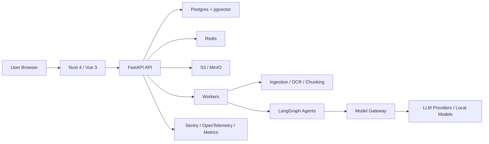
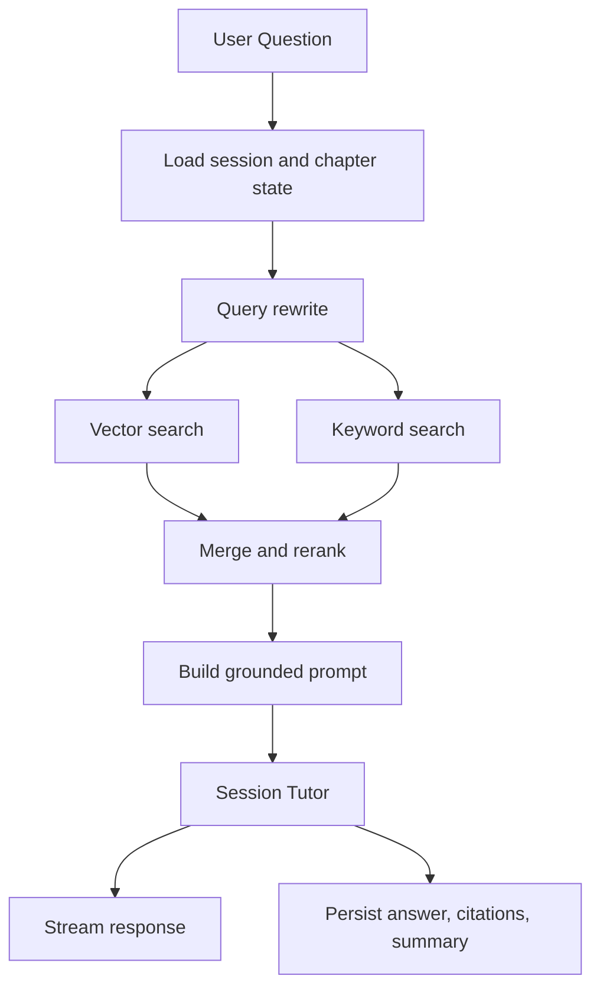

# study_agent Design Spec

Date: 2026-05-24

## Decision Summary

Build study_agent as a Web-first personal learning agent MVP with enterprise extension points. The product uses a Production Modular Monolith architecture: Nuxt/Vue front end, FastAPI modular back end, background workers, Postgres with pgvector, Redis, object storage, and LangGraph for durable agent workflows.

The first production milestone focuses on this loop:

```text
Import materials -> generate route -> study by chapter -> chat -> quiz -> update mastery -> review
```

## Product Scope

### MVP

- Personal account and workspace.
- Study space creation with name, goal, level, study intensity, timeline, and source materials.
- PDF, image, Markdown, text, and webpage source ingestion.
- AI-generated editable learning route.
- Chapter-based learning subspaces.
- Multiple independent sessions per chapter.
- Three-layer agent system: space planner, chapter mentor, session tutor.
- Streaming chat with source citations.
- Notes, quizzes, mastery tracking, and review cards.
- Versioned import/export package for local portability.

### Reserved Enterprise Interfaces

- Tenant-aware data model.
- Membership and role model.
- Audit logs.
- Model Gateway abstraction.
- Storage abstraction.
- Knowledge connector abstraction.
- Deployment profiles for cloud and private environments.

Out of scope for MVP: SSO, organization admin, full RBAC UI, enterprise knowledge connectors, audit search UI, and multi-class teaching workflows.

## Architecture



## Technical Choices

- Front end: Nuxt 4, Vue 3, TypeScript, Tailwind CSS, shadcn-vue/Reka UI, Pinia.
- Back end: FastAPI, Pydantic v2, SQLAlchemy 2.x async, Alembic.
- Data: Postgres, pgvector, Redis, S3-compatible object storage.
- Agent runtime: LangGraph Python.
- Streaming: SSE for chat responses.
- Local development: Docker Compose with Postgres, Redis, MinIO, API, worker, and front end.
- Observability: Sentry, OpenTelemetry, metrics dashboard.

## UI Design

The app should feel like a focused productivity tool rather than a marketing site. It should use quiet visual hierarchy, compact controls, and clear status colors.

- Primary color: blue or indigo.
- Success/mastered: green.
- Review/warning: amber.
- Weak/error: red.
- Cards: max 8px radius.
- Main navigation: left sidebar.
- Top navigation: product identity, current space, global search, notifications, model status, user menu.

## Core Pages

### Dashboard

Purpose: resume learning quickly.

Elements:

- `New Study Space` primary button.
- Recent spaces grid.
- Due reviews list.
- Progress overview.
- Empty state with creation action.

Key APIs:

- `GET /api/v1/study-spaces`
- `GET /api/v1/reviews/due`
- `GET /api/v1/progress/overview`

### Create Study Space

Purpose: collect user goal and materials, then generate an editable route.

Elements:

- Step 1: name, goal, level, intensity, timeline.
- Step 2: file dropzone, webpage URL input, source status list.
- Step 3: editable route textarea, outline preview, `AI Render` secondary button, create button.

Key APIs:

- `POST /api/v1/uploads/presign`
- `POST /api/v1/study-spaces/draft-route`
- `POST /api/v1/study-spaces`
- `GET /api/v1/jobs/{job_id}`

### Study Space Home

Purpose: show the route, global learning state, and next action.

Elements:

- Space header with name, goal, progress, export, and settings.
- Route timeline or chapter list.
- Chapter status badges.
- Space planner insight panel.
- Replan and review-plan actions.

Key APIs:

- `GET /api/v1/study-spaces/{id}`
- `GET /api/v1/study-spaces/{id}/chapters`
- `GET /api/v1/study-spaces/{id}/insights`
- `POST /api/v1/agents/space-planner/run`

### Chapter Study Page

Purpose: primary learning surface.

Layout: three columns.

Left:

- Chapter goal.
- Knowledge points.
- Source references.
- Session list.
- New session button.

Center:

- Chat messages.
- User messages right-aligned.
- AI messages left-aligned.
- Citations, save note, generate exercise, regenerate actions.
- Composer with textarea, attachment, send, stop, and shortcut actions.

Right:

- Chapter mentor summary.
- Difficult points.
- Common mistakes.
- Mastered and unmastered points.
- Quiz entry.
- Review cards.
- Mastery progress.

Key APIs:

- `GET /api/v1/chapters/{id}`
- `GET /api/v1/chapters/{id}/sessions`
- `POST /api/v1/chapters/{id}/sessions`
- `GET /api/v1/sessions/{id}/messages`
- `POST /api/v1/sessions/{id}/messages:stream`
- `POST /api/v1/messages/{id}/save-note`
- `POST /api/v1/agents/chapter-summary/run`

### Quiz Page

Purpose: measure understanding and update mastery.

Elements:

- Quiz header.
- Question form.
- Radio groups for single-choice questions.
- Textareas for short answers.
- Submit button.
- Result panel with score, explanation, weak points, and review suggestions.

Key APIs:

- `POST /api/v1/chapters/{id}/quizzes/generate`
- `GET /api/v1/quizzes/{id}`
- `POST /api/v1/quizzes/{id}/submit`
- `GET /api/v1/quizzes/{id}/result`

### Library

Purpose: inspect and manage source materials.

Elements:

- Source table.
- Search and filters.
- Source detail drawer.
- Chunk and embedding status.
- Reprocess and delete actions.

Key APIs:

- `GET /api/v1/study-spaces/{id}/sources`
- `GET /api/v1/sources/{id}`
- `POST /api/v1/sources/{id}/reprocess`
- `DELETE /api/v1/sources/{id}`

## Data Model

Core tables:

```text
tenants
users
memberships
study_spaces
sources
source_chunks
learning_routes
chapters
chapter_knowledge_points
sessions
messages
agent_runs
notes
quizzes
quiz_questions
quiz_submissions
mastery_records
review_cards
audit_logs
exports
```

Rules:

- Every core business record has `tenant_id`.
- A study space owns sources, route, chapters, sessions, notes, quizzes, mastery, and review cards.
- Sessions have independent message context.
- Long-term memory is stored as structured chapter summaries, mastery records, and review cards.
- `agent_runs` records inputs, outputs, status, model metadata, latency, token usage, and error details.

## Agent Design

### Space Planner

Reads: learning goal, source summaries, route, chapter progress, quiz outcomes.

Writes: learning routes, chapters, review cards, global insight, agent runs.

Can propose route changes, but high-impact changes require user confirmation.

### Chapter Mentor

Reads: chapter goal, linked source chunks, session summaries, quiz results.

Writes: knowledge points, weak points, common mistakes, mastery suggestions, chapter summary.

Can update chapter learning state, but cannot delete user content.

### Session Tutor

Reads: current session messages, chapter summary, retrieved source chunks, user question.

Writes: streamed answer, citations, notes, message summary, agent run.

Cannot directly modify the global learning route.

## RAG Flow



If no source evidence is found, the assistant must say that the study materials do not contain enough evidence and ask whether to answer from general knowledge.

## Background Jobs

- Ingestion: parse PDF, images, text, Markdown, and webpages.
- Embedding: chunk text and write vectors.
- Route generation: create route drafts from source summaries and user goals.
- Chapter summary: update learning state after chat or quiz activity.
- Quiz generation: generate chapter quizzes.
- Export packaging: create versioned export zip.

## Import and Export

Export package:

```text
study-space-export.zip
  manifest.json
  sources/
  route.json
  chapters/
    chapter-001/
      metadata.json
      notes.md
      mastery.json
      quiz-history.json
      session-summaries.json
  audit-summary.json
```

`manifest.json` includes `schema_version`, product version, export time, source file metadata, and compatibility notes.

## Security

- JWT access token and refresh token.
- Refresh token in HttpOnly Cookie.
- Tenant and membership checks on every resource.
- Presigned URLs for object storage.
- File type and size limits.
- Optional virus scanning hook.
- Model API keys never exposed to the browser.
- Prompt injection mitigation by separating system instructions, user content, and retrieved source content.
- Human approval for route replacement, source deletion, and bulk note overwrite.
- Audit logs for login, upload, delete, export, replan, permission denial, and model failure.

## Observability

Track:

- API latency and error rate.
- SSE interruption rate.
- Worker queue length and task failures.
- Source parsing time.
- Embedding and model token cost.
- Model timeout and retry rate.
- Postgres slow queries and connection usage.
- Redis memory and queue health.

## Delivery Phases

1. Phase 0: scaffold, CI, database, auth, app shell.
2. Phase 1: study spaces, uploads, ingestion, route generation.
3. Phase 2: chapter page, streaming chat, RAG citations, session summaries.
4. Phase 3: quizzes, mastery, review cards, import/export.
5. Phase 4: observability, security hardening, staging and production deployment.
6. Phase 5: tenant admin, RBAC, audit UI, model routing policies.

## Acceptance Criteria

- A user can create a study space from a goal and at least one source.
- The system can parse the source and generate an editable route.
- The user can enter a chapter, chat with streaming responses, and see source citations.
- The user can complete a generated quiz and receive explanations.
- Mastery records and review cards update after quiz submission.
- The user can export and re-import a study space.
- Every core record is tenant-scoped.
- Agent runs are persisted with enough metadata for debugging.
