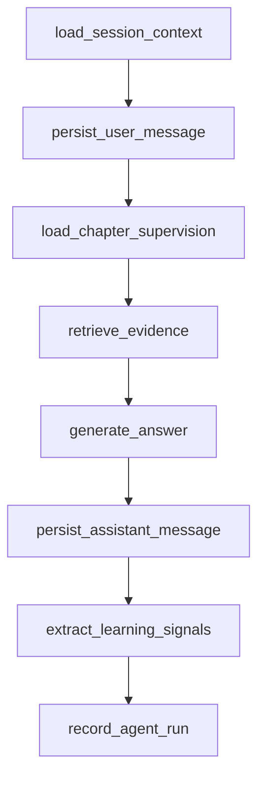

# Session Tutor LangGraph Design

## Purpose

Introduce LangGraph at the lowest and highest-frequency layer of the three-agent learning system: the Session Tutor. This phase converts the current one-shot tutor answer flow into an explicit graph while preserving the existing API contract, persistence model, and frontend behavior.

The goal is not to build a full multi-agent supervisor in one pass. The goal is to make the L3 execution agent durable, inspectable, and ready to be supervised by the L2 Chapter Mentor and L1 Space Planner.

## Current State

The product already has the three domain layers:

- L1 Space Planner writes `space_planner_states`, creates planner actions, and records `agent_runs` with `agent_type=space_planner`.
- L2 Chapter Mentor writes `chapter_mentor_states`, derives weak points and next actions, and records `agent_runs` with `agent_type=chapter_mentor`.
- L3 Session Tutor stores sessions, user messages, assistant messages, citations, and `agent_runs` with `agent_type=session_tutor`.

The current Session Tutor flow lives in `apps/api/app/domain/sessions/service.py`:

1. Validate the session belongs to the tenant.
2. Persist the user message.
3. Retrieve RAG chunks for the question.
4. Load source filenames.
5. Call the answer provider.
6. Persist the assistant message and citations.
7. Record an `agent_runs` row.

This flow works, but the orchestration is implicit. There is no graph-level state, node-level audit trail, checkpoint boundary, or explicit place for L2/L1 supervision signals.

## Recommended Approach

Implement a Session Tutor LangGraph foundation.

The graph will be introduced behind the existing `answer_session_message()` service boundary so routes and frontend pages do not change. The first implementation keeps deterministic behavior available for tests and local development, while adding the graph abstraction needed for future streaming, retries, tool use, and multi-agent supervision.

## Three-Layer Agent Alignment

```text
L1 Space Planner / Main Agent
  Owns global learning route, review priorities, risk management, and planner actions.
  Future input: learning signals emitted by Session Tutor and Chapter Mentor.

L2 Chapter Mentor / Supervisory Agent
  Owns chapter-level understanding, weak points, next actions, and assessment context.
  Current input to L3: chapter_mentor_state read before tutor answer generation.

L3 Session Tutor / Execution Agent
  Owns one learning session turn: user question, RAG retrieval, grounded answer, citations,
  message persistence, agent run recording, and learning signal extraction.
```

This phase implements L3 and defines the supervision interfaces:

- L3 reads L2 state before answering when available.
- L3 emits structured `learning_signals` in `AgentRun.output_payload`.
- L1 does not consume those signals yet; that is a later phase.
- L3 does not mutate routes, planner states, planner actions, quizzes, or mastery records.

## Scope

Implement in this phase:

- Add LangGraph dependencies to the API project.
- Add a focused agent runtime module with graph config and state contracts.
- Add a Session Tutor graph module.
- Route the existing session tutor answer flow through the graph.
- Preserve existing API response shapes.
- Persist messages, citations, and `agent_runs` exactly as the current route expects.
- Include L2 Chapter Mentor state in graph state when it exists.
- Emit L1-ready learning signals in `AgentRun.output_payload`.
- Add tests for graph state transitions, supervision context, persistence, and fallback behavior.

Do not implement in this phase:

- Full L1/L2/L3 parent graph.
- Background workers.
- Streaming SSE.
- Automatic planner reruns.
- Automatic route mutation.
- Automatic quiz or mastery updates.
- Human approval workflows for planner actions.
- Production observability dashboards.

## Backend Architecture

### New Module: `app/domain/agent_runtime`

Purpose: shared primitives for current and future graph-backed agents.

Planned files:

- `state.py`: shared typed state fragments, such as `LearningSignal`.
- `config.py`: feature flags and graph runtime configuration.
- `checkpoints.py`: checkpointer factory with a no-op or memory default and a Postgres-ready interface.

The first implementation should avoid pushing LangGraph details into routes. Routes should continue calling domain services.

### New Module: `app/domain/session_tutor_graph`

Purpose: own the L3 graph and keep it separate from generic session persistence helpers.

Planned files:

- `state.py`: `SessionTutorGraphState`.
- `nodes.py`: graph node functions.
- `graph.py`: graph construction and invocation.
- `service.py`: public graph runner used by `sessions.service`.

### Existing Module: `app/domain/sessions`

`answer_session_message()` remains the compatibility boundary. It should delegate to the Session Tutor graph when enabled and keep the old deterministic path as a fallback during migration.

Persistence helpers such as `create_message()`, `create_message_with_response()`, `list_messages_for_session()`, and `record_agent_run()` should remain in `sessions.service` unless the file becomes difficult to maintain during implementation. If extraction is needed, move only persistence helpers into `sessions.persistence` and keep behavior unchanged.

## Session Tutor Graph

The first graph is intentionally linear:



### Node Responsibilities

`load_session_context`

- Verify `session_id` belongs to the tenant.
- Load `study_space_id` and `chapter_id`.
- Store stable IDs in graph state.

`persist_user_message`

- Persist the learner's message with `role=user`.
- Store `user_message_id`.

`load_chapter_supervision`

- Read `chapter_mentor_state` by `tenant_id` and `chapter_id`.
- If no state exists, continue with `chapter_supervision=null`.
- Store summary, weak points, and next actions in graph state.

`retrieve_evidence`

- Run existing RAG retrieval scoped by tenant and study space.
- Store retrieved chunks and source filenames in graph state.

`generate_answer`

- Call the existing `AnswerProvider`.
- Pass chapter supervision as additional context if the provider supports it in this phase.
- If the provider interface is not expanded immediately, include supervision in graph state and record it in `AgentRun.input_payload`, then expand the provider in a later PR.

`persist_assistant_message`

- Persist assistant content and citations through the existing message helpers.
- Store `assistant_message_id` and citation count.

`extract_learning_signals`

- Produce deterministic structured signals from question text, answer, citations, and supervision context.
- Initial signal examples:
  - `confusion_detected`
  - `needs_review`
  - `evidence_used`
  - `chapter_supervision_used`

`record_agent_run`

- Record `agent_type=session_tutor`.
- Include graph node names, supervision context availability, learning signals, citation count, and message IDs.
- Mark failed runs with `AgentRunStatus.failed` when graph execution fails after the user message is persisted.

## Graph State Contract

`SessionTutorGraphState` should include:

- `tenant_id`
- `user_id`
- `session_id`
- `study_space_id`
- `chapter_id`
- `content`
- `user_message_id`
- `assistant_message_id`
- `retrieved_chunks`
- `source_filenames`
- `answer`
- `citations`
- `chapter_supervision`
- `learning_signals`
- `node_trace`
- `error_message`

The state must be serializable enough for future checkpoint persistence. If an object such as a SQLAlchemy model or retrieved chunk is not directly serializable, the graph should keep only the primitive fields required by downstream nodes or convert the value before checkpoint boundaries.

## Checkpoint Strategy

This phase should add the runtime boundary without forcing production checkpoint deployment immediately.

Default behavior:

- Local/test mode can use no checkpointer or an in-memory checkpointer.
- A Postgres checkpointer factory should be reserved behind configuration, but it does not need to be enabled by default.
- The `thread_id` should be deterministic for a session turn, such as `session:{session_id}:message:{user_message_id}` after the user message is created.

Future production behavior:

- Use Postgres-backed checkpoints for resumable graph runs.
- Store checkpoint metadata aligned with `tenant_id`, `study_space_id`, `chapter_id`, and `session_id`.

## Error Handling

Before user message persistence:

- Fail without creating messages.
- Return the existing route error behavior.

After user message persistence:

- Record a failed `agent_runs` row when possible.
- Do not create a partial assistant message unless the answer was successfully generated.
- Surface the same API error status currently used by session routes.

RAG failures:

- Treat as graph failure in this phase rather than silently answering without citations.
- A later phase can add a fallback node for non-RAG answers if the product needs it.

Answer provider failures:

- Record `AgentRunStatus.failed` with `error_message`.
- Do not mark learning signals as successful.

## API Compatibility

No route changes are required.

Existing clients should continue calling the same endpoint used for session tutor messages and receive the same `MessageResponse` shape:

- assistant message id
- session id
- role
- content
- citations
- created timestamp

The graph is an internal orchestration detail.

## Data Persistence

No new database migration is required for the first phase.

Use existing tables:

- `sessions`
- `messages`
- `message_citations`
- `agent_runs`
- `chapter_mentor_states`

Graph-specific metadata should be stored in existing JSON payloads:

- `AgentRun.input_payload`
- `AgentRun.output_payload`

If later checkpoint persistence requires LangGraph-managed tables, that should be a separate migration and PR.

## Testing Strategy

Backend unit tests:

- Graph loads session context and persists user/assistant messages.
- Graph reads chapter mentor state when available.
- Graph continues when chapter mentor state is absent.
- Graph records `agent_runs` with node trace and learning signals.
- Graph records failed `agent_runs` when answer generation fails after user message persistence.
- Existing session route tests continue to pass without API changes.

Integration tests:

- Keep Postgres-specific checkpoint tests guarded behind an opt-in environment flag if checkpoint persistence is introduced.
- Do not require external LLM calls in CI.

Frontend tests:

- No required frontend changes in this phase.
- Existing session tutor UI tests should continue to pass.

## Deployment Notes

This phase requires adding API dependencies for LangGraph. The runtime should remain disabled or fallback-safe until dependencies and local verification are stable.

Recommended configuration:

- `SESSION_TUTOR_GRAPH_ENABLED=true` for local development after tests pass.
- `SESSION_TUTOR_GRAPH_CHECKPOINT_BACKEND=memory` or `none` initially.
- Postgres checkpoint configuration reserved for a later production-hardening PR.

## Acceptance Criteria

- Existing session tutor endpoint still returns the same response shape.
- Existing backend tests pass.
- New graph tests pass.
- `AgentRun.output_payload` includes `node_trace` and `learning_signals` for graph-backed session tutor runs.
- Chapter Mentor state is read by the graph and reflected as supervision metadata when available.
- No frontend behavior regresses.
- No route, planner action, quiz, or route generation behavior changes.

## Future Phases

After this foundation lands:

1. Add streaming from graph node events to the frontend.
2. Enable Postgres-backed checkpoints.
3. Let Chapter Mentor consume Session Tutor learning signals.
4. Let Space Planner aggregate chapter-level signals into planner actions.
5. Add a true L1 supervisor graph that can invoke L2 and L3 as tools under explicit product constraints.
