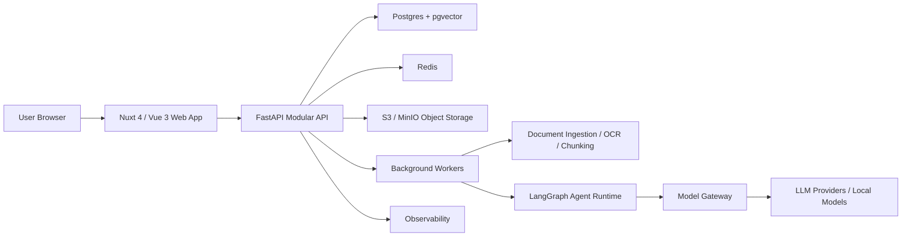
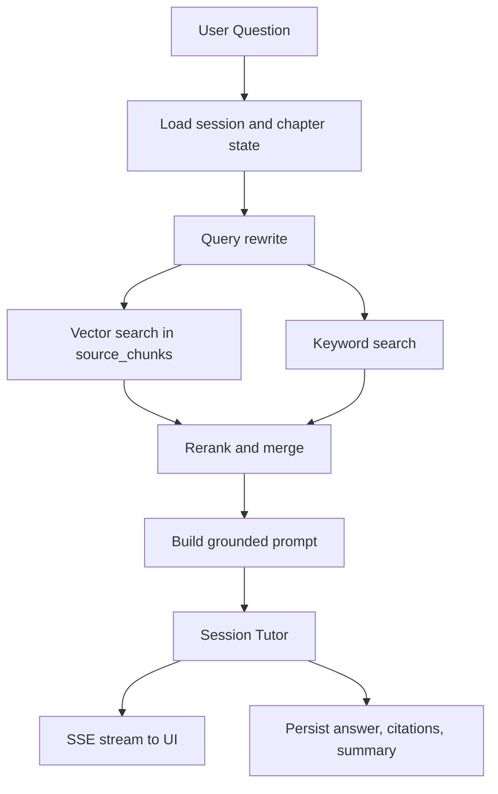

# study_agent 产品报告

## 1. 产品定位

study_agent 是一个帮助用户系统学习的智能体平台。第一版定位为 Web-first 的个人自学助手，支持用户上传教材、生成学习路线、按章节学习、与 AI 对话答疑、完成章节测评、形成掌握画像并安排复习。

产品路线采用“个人学习 MVP + 企业级接口预留”。MVP 优先服务个人自学闭环，但底层从第一天预留租户、权限、审计、模型网关、知识库连接器和私有化部署能力，后续可扩展为企业培训和组织知识学习平台。

## 2. 产品目标

- 帮助用户把零散资料转成可执行学习路线。
- 在每个章节内提供上下文准确、引用资料来源的 AI 答疑。
- 通过小测、错题、复习卡片和掌握度记录形成学习闭环。
- 保持学习空间可迁移，支持导入/导出本地结构化包。
- 按生产级系统标准设计数据、权限、部署、监控和安全边界。

## 3. MVP 范围

MVP 的核心流程是：

```text
导入资料 -> 生成学习路线 -> 进入章节学习 -> 对话答疑 -> 章节测评 -> 更新掌握画像 -> 复习推荐
```

MVP 必做：

- 账号登录和个人工作区。
- 学习空间创建、编辑、删除、导入、导出。
- PDF、图片、文本、Markdown、网页链接资料导入。
- 资料解析、OCR、正文抽取、分块、向量化。
- AI 生成学习路线，用户可编辑，支持“AI 渲染”。
- 章节子空间、会话列表、独立聊天上下文。
- 三层 agent：主 agent、章节 agent、会话 agent。
- 流式聊天、引用来源、保存笔记、重新生成。
- 自动生成章节小测、AI 评分、解析和薄弱点总结。
- 知识点掌握度、复习卡片、待复习列表。

MVP 不做但预留：

- 组织、班级、团队管理。
- SSO/SAML/OIDC。
- 细粒度 RBAC。
- 企业知识库连接器。
- 审计日志查询后台。
- 私有模型策略和多模型成本治理。

## 4. 技术栈

整体采用 Production Modular Monolith：前端、后端、worker 分进程部署，但后端业务以模块化单体组织，避免第一版过早微服务化。

### 4.1 前端

- Nuxt 4 + Vue 3 + TypeScript。
- Tailwind CSS 做样式系统。
- shadcn-vue / Reka UI 做可访问组件基础。
- Pinia 管理客户端状态。
- SSE 接收聊天流式输出。
- ECharts 或 Tremor 风格组件展示学习进度和掌握度。

### 4.2 后端

- FastAPI + Pydantic v2。
- SQLAlchemy 2.x async + Alembic。
- Postgres 作为主数据库。
- pgvector 存储 embedding 并做向量检索。
- Redis 做缓存、队列协调、限流和短期状态。
- S3-compatible storage 存储上传文件和导出包，本地开发使用 MinIO。

### 4.3 Agent 与 AI

- LangGraph Python 编排长期、可恢复、多步骤 agent 工作流。
- Model Gateway 封装 OpenAI、Anthropic、本地模型或企业私有模型。
- RAG 检索采用向量检索 + 关键词检索 + rerank/合并。
- LangSmith 或 OpenTelemetry trace 记录 agent 执行过程。

### 4.4 部署与运维

- Docker Compose 用于本地开发和轻量私有化部署。
- 云生产可部署到 AWS/GCP/Azure/Cloud Run/ECS/Fly.io/Render。
- 托管 Postgres、Redis、S3/R2 优先。
- Sentry + OpenTelemetry + Prometheus/Grafana 或云监控。

## 5. 系统架构



## 6. 核心页面与交互

### 6.1 全局布局

- `header`：左侧产品标识和当前空间名，中间全局搜索，右侧通知、模型状态、用户菜单。
- `aside`：学习空间、待复习、资料库、学习画像、设置。宽度约 240px，可折叠。
- `main`：页面主内容区，默认最大宽度 1280px，章节学习页可全宽。
- 全局反馈：toast、loading skeleton、错误 banner、确认弹窗。

视觉风格保持专业、安静、信息密度适中。主色使用深靛蓝/蓝色，绿色表示掌握，琥珀色表示待复习，红色表示薄弱或失败。卡片圆角控制在 8px。

### 6.2 工作台 `/dashboard`

元素：

- 主按钮 `新建学习空间`，位于右上角。
- 最近学习空间卡片网格。
- 今日待复习列表。
- 学习进度概览图。
- 空状态创建入口。

接口：

- `GET /api/v1/study-spaces`
- `GET /api/v1/reviews/due`
- `GET /api/v1/progress/overview`
- `POST /api/v1/study-spaces`

### 6.3 创建学习空间 `/spaces/new`

采用三步表单。

Step 1 基础信息：

- `input`：空间名称。
- `textarea`：学习目标。
- `select`：基础水平、学习强度、目标周期。

Step 2 资料导入：

- `dropzone`：上传 PDF、图片、Markdown、TXT。
- `input`：网页链接。
- 文件列表显示等待上传、上传中、解析中、完成、失败。

Step 3 学习路线：

- 左侧 `textarea`：用户可编辑路线草稿。
- 右侧章节树预览。
- 小按钮 `AI 渲染`：放在 textarea 右上角，次级按钮，使用 sparkle 图标。
- 主按钮 `创建空间`：底部右侧。

接口：

- `POST /api/v1/uploads/presign`
- `POST /api/v1/study-spaces/draft-route`
- `POST /api/v1/study-spaces`
- `GET /api/v1/jobs/{job_id}`

### 6.4 学习空间首页 `/spaces/:spaceId`

元素：

- 空间头部：名称、目标、总体进度、导出按钮、设置按钮。
- 学习路线：纵向时间线或章节列表。
- 章节节点：标题、掌握度、待复习数量、最近会话时间。
- 右侧主 agent 面板：当前状态、下一步建议、风险点。
- 按钮：重新规划路线、生成复习计划。

接口：

- `GET /api/v1/study-spaces/{id}`
- `GET /api/v1/study-spaces/{id}/chapters`
- `GET /api/v1/study-spaces/{id}/insights`
- `POST /api/v1/study-spaces/{id}/export`
- `POST /api/v1/agents/space-planner/run`

### 6.5 章节学习页 `/spaces/:spaceId/chapters/:chapterId`

采用三栏布局。

左栏：

- 章节目标。
- 知识点列表。
- 资料引用。
- 会话列表。
- `新建会话`按钮。

中栏：

- 消息列表。
- 用户消息靠右，AI 消息靠左。
- AI 消息包含正文、引用来源、保存笔记、生成练习、重新生成。
- 底部输入区包含 textarea、附件按钮、发送按钮、停止按钮。
- 快捷动作：解释、举例、出题、总结、检查理解。

右栏：

- 章节 agent 摘要。
- 难点、易错点、已掌握、未掌握。
- 小测入口。
- 复习卡片。
- 掌握度进度条。

接口：

- `GET /api/v1/chapters/{id}`
- `GET /api/v1/chapters/{id}/sessions`
- `POST /api/v1/chapters/{id}/sessions`
- `GET /api/v1/sessions/{id}/messages`
- `POST /api/v1/sessions/{id}/messages:stream`
- `POST /api/v1/messages/{id}/save-note`
- `POST /api/v1/agents/chapter-summary/run`

### 6.6 测评页 `/chapters/:chapterId/quiz`

元素：

- 测评头部：章节名、预计耗时、题数。
- 题目表单。
- `radio-group`：选择题。
- `textarea`：简答题。
- `提交测评`按钮。
- 结果面板：得分、解析、薄弱知识点、复习建议。

接口：

- `POST /api/v1/chapters/{id}/quizzes/generate`
- `GET /api/v1/quizzes/{id}`
- `POST /api/v1/quizzes/{id}/submit`
- `GET /api/v1/quizzes/{id}/result`

### 6.7 资料库 `/spaces/:spaceId/library`

元素：

- 文件表格：名称、类型、解析状态、所属章节、上传时间。
- 搜索框和筛选器。
- 文档详情抽屉：原文片段、chunks、embedding 状态、引用到的会话。
- 重新解析按钮。

接口：

- `GET /api/v1/study-spaces/{id}/sources`
- `GET /api/v1/sources/{id}`
- `POST /api/v1/sources/{id}/reprocess`
- `DELETE /api/v1/sources/{id}`

## 7. 数据模型

核心表：

```text
tenants
users
memberships
study_spaces
sources
source_chunks
learning_routes
chapters
chapter_knowledge_points
sessions
messages
agent_runs
notes
quizzes
quiz_questions
quiz_submissions
mastery_records
review_cards
audit_logs
exports
```

关键原则：

- 所有核心业务表带 `tenant_id`。
- 学习空间是主要聚合根。
- 会话上下文互相独立。
- 长期记忆使用结构化学习状态，而不是无限拼接聊天历史。
- agent 执行过程记录到 `agent_runs`，便于排错、审计和成本分析。

## 8. Agent 工作流

### 8.1 主 Agent：Space Planner

输入：学习目标、资料摘要、章节进度、测评结果。

输出：学习路线、全局建议、复习计划、章节任务分配。

写入：`learning_routes`、`chapters`、`review_cards`、`agent_runs`。

### 8.2 章节 Agent：Chapter Mentor

输入：章节目标、关联资料 chunks、该章所有会话摘要、测评结果。

输出：知识点结构、难点、易错点、掌握度建议、下一步学习任务。

写入：`chapter_knowledge_points`、`mastery_records`、章节摘要。

### 8.3 会话 Agent：Session Tutor

输入：当前会话消息、章节摘要、相关资料检索结果、用户问题。

输出：流式答复、引用来源、练习题建议、本轮摘要。

写入：`messages`、`notes`、`agent_runs`，必要时触发章节 agent 更新。

### 8.4 权限边界

- 会话 agent 不直接改全局路线。
- 章节 agent 可更新章节学习状态，但不能删除用户内容。
- 主 agent 可重新规划路线，但必须展示 diff 并要求用户确认。
- 删除资料、重排路线、批量覆盖笔记等高影响操作必须 human-in-the-loop。

## 9. RAG 检索流程



当检索不到依据时，AI 必须说明资料中未找到明确内容，并询问用户是否允许使用通用知识回答。

## 10. 后台任务

- `ingestion`：解析 PDF、图片、网页。
- `embedding`：分块、生成向量、写入 pgvector。
- `route_generation`：资料解析完成后生成路线草稿。
- `chapter_summary`：会话结束或测评后更新章节摘要。
- `quiz_generation`：根据章节资料生成小测。
- `export_packaging`：打包本地导出 zip。

## 11. 导入导出格式

导出包示例：

```text
study-space-export.zip
  manifest.json
  sources/
  route.json
  chapters/
    chapter-001/
      metadata.json
      notes.md
      mastery.json
      quiz-history.json
      session-summaries.json
  audit-summary.json
```

`manifest.json` 必须包含 `schema_version`，例如 `"1.0"`。导入器按版本兼容，避免未来格式变更破坏旧导出包。

## 12. 安全与合规

- JWT access token + refresh token。
- refresh token 存 HttpOnly Cookie。
- 对象存储使用短时 presigned URL。
- 上传文件限制类型和大小，预留病毒扫描接口。
- 模型 API key 只保存在后端。
- Prompt 注入防护：系统指令、用户资料、检索上下文分层隔离。
- 高风险工具调用必须用户确认。
- 审计日志记录登录、上传、删除、导出、重规划、权限拒绝和模型调用失败。

## 13. 监控与运维

- API 延迟、错误率、SSE 中断率。
- worker 队列长度和任务失败率。
- 文档解析耗时。
- embedding 和模型调用 token 成本。
- Postgres 慢查询和连接数。
- Redis 内存和队列积压。
- Sentry 记录前后端异常。
- OpenTelemetry 记录 API、worker、agent、模型调用链路。

## 14. 阶段计划

- Phase 0：项目脚手架、基础 CI、数据库、登录、布局。
- Phase 1：学习空间、资料上传、解析、路线生成。
- Phase 2：章节页、聊天 SSE、RAG 引用、会话摘要。
- Phase 3：测评、掌握度、复习卡片、导出/导入。
- Phase 4：可观测性、安全加固、staging/production 部署。
- Phase 5：企业预留接口落地，包括 tenant admin、RBAC、审计查询、模型网关策略。
